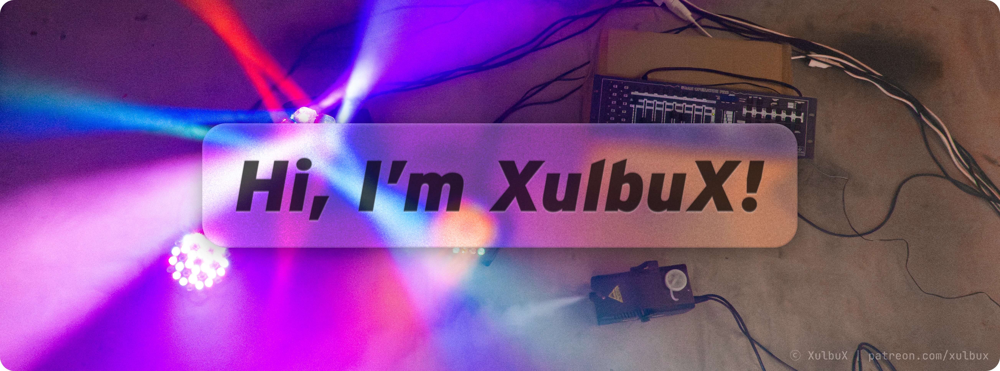

<div align="center">

<a href="#"></a>
<h6>You can easily create a very similar banner image yourself using <strong><a href="https://xulbux.github.io/banner-maker">Banner Maker</a></strong>.</h6>

<br>
<br>

[](#)

</div>

# < **About Me** />[](#-about-me-)

Love in coding and technical thinking – good eye for colors and<br>
modern design – hobby photographer and short film creator<br>
**—⠀always creating more cool stuff for you!**

<br>
<br>

<div align="center">

[](#)

</div>

# < **Current Focus** />[](#-current-focus-)

- 🐍 Mastering the art of **[Python](https://github.com/xulbux/python)**.
- 🚀 Trying to learn more about `C`, `C#` and `C++`.
- 📦 Working on constant updates and improvements of my own **[Python library `xulbux`](https://github.com/xulbux/python-lib-xulbux)**.
- 📟 Writing super useful and powerful **[command line tools](https://github.com/xulbux/python/tree/main/Projects/Commands)** and optimizing the heck out of them.
- 🧩 Making **[VSCode extensions](https://marketplace.visualstudio.com/publishers/xulbux)** which I personally can't live without anymore and use all the time.
- 🌐 Crafting **[beautiful websites](https://xulbux.github.io/html-mechanics)** and apps with `HTML5` `CSS3` `PHP` `JS` `TS` (+ Inertia, Vue.js, Laravel, …).
- 🎨 Diving deep into the world of designing (colors, layout, typography, …) for the perfect user experience.
- 🎥 Creating **[stunning photos](https://www.patreon.com/cw/xulbux/shop)** and short films and editing them professionally.

### 🔥 **I Definitely Recommend Checking Out**
[](https://github.com/xulbux/python-lib-xulbux) [](https://github.com/xulbux/vscode) [](https://github.com/xulbux/python)

<br>

# < **Let's Connect!** />[](#-lets-connect-)

Feel free to explore my repositories and don't hesitate to reach out<br>
for questions or just a friendly chat about coding and designing!

<br>

# < **Tech Stack** />[](#-tech-stack-)

<div align="center"><br>

[](#)<br><br>

[](#)<br><br>

[](#)&#8195;&#8195;&#8194;&#8202;
[](#)<br><br>

[](#)&#8195;&#8195;&#8194;&#8202;
[](#)

</div>

<br>

# < **GitHub** />[](#-github-)

### 📈 **Stats**
[](#) [](#)<br>
[](#)

### 🏆 **Trophies**
[](#)


<br>
<br>
<br>
<br>

------------------------------------------------------------------

<br>
<br>

<div align="center">

[](#)

✨ From **[XulbuX](https://github.com/xulbux)** ✨<br>
**ദ്ദി(˵ •̀ ᴗ - ˵ ) ✧**

<br>
<br>

```console
               __  __              
  _  __ __  __/ / / /_  __  ___  __
 | |/ // / / / / / __ \/ / / | |/ /
 > , </ /_/ / /_/ /_/ / /_/ /> , < 
/_/|_|\____/\__/\____/\____//_/|_|
 
```

</div>
