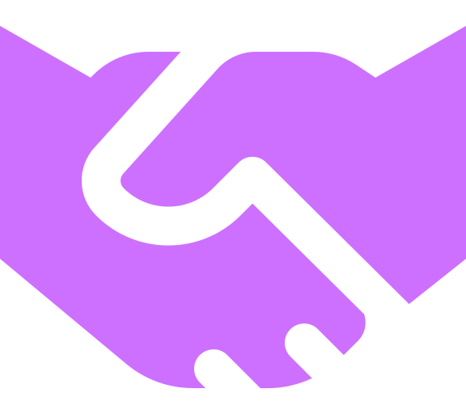
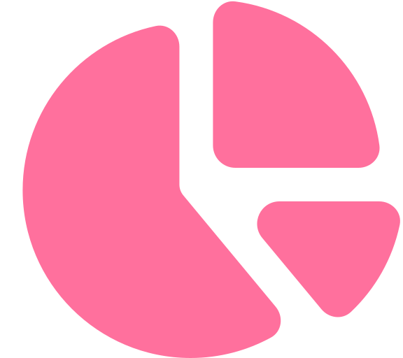

<div align="center">
  
  <h1 style="display:flex"> <!-- each new can wrap -->
    $\Huge\textsf{Hi, I'm}$
    $\Huge\textsf{XulbuX!}$
    $\Huge\textsf{👋 }$
    $\Huge\textsf{Nice}$
    $\Huge\textsf{to see}$
    $\Huge\textsf{you here.}$
  </h1>
  
  <br>
  <br>
  
  [](#)

</div>

# < **About Me**  />
Developer on GitHub – good eye for colors and modern design – hobby photographer and short film creator – always creating more cool stuff for you!

<br>
<br>

<div align="center">

[](#)

</div>

# < **Current Focus**  />
- 🐍 Mastering the art of Python
- ☕ Getting to know Java and its features
- 🔧 Trying to learn more about C# and C++
- 🖥️ Crafting beautiful web experiences with HTML, CSS and JS (+ Inertia, VUE, PHP, etc.)
- 🛠️ Diving deep into the world of designing for the perfect user experience

<br>

# < **Let's Connect!**  />
Feel free to explore my repositories and don't hesitate to reach out for questions or just a friendly chat about coding and designing!

<br>

# < **Tech Stack**  />
[](#) [](#) [](#) [](#) [](#) [](#) [](#) [](#) [](#) [](#) [](#) [](#) [](#) [](#) [](#) [](#) [](#) [](#) [](#) [](#) [](#) [](#) [](#) [](#) [](#) [](#) [](#) [](#) [](#) [](#) [](#) [](#) [](#) [](#) [](#) [](#) [](#) [](#) [](#) [](#) [](#) [](#) [](#) [](#) [](#) [](#) [](#) [](#) [](#) [](#) [](#) [](#) [](#) [](#) [](#) [](#) [](#) [](#) [](#) [](#) [](#) [](#) [](#) [](#) [](#) [](#) [](#) [](#) [](#) [](#) [](#) [](#) [](#) [](#) [](#) [](#) [](#) [](#) [](#) [](#) [](#) [](#) [](#) [](#)

<br>

# < **GitHub**  />

### 📈 **Stats**
[](#) [](#)

### 🏆 **Trophies**
[](#)


<br>
<br>
<br>
<br>

------------------------------------------------------------------

<br>
<br>

<div align="center">

[](#)

✨ From **[XulbuX](https://github.com/XulbuX)** ✨

<br>
<br>

```console
               __  __              
  _  __ __  __/ / / /_  __  ___  __
 | |/ // / / / / / __ \/ / / | |/ /
 > , </ /_/ / /_/ /_/ / /_/ /> , < 
/_/|_|\____/\__/\____/\____//_/|_|
 
```

</div>
